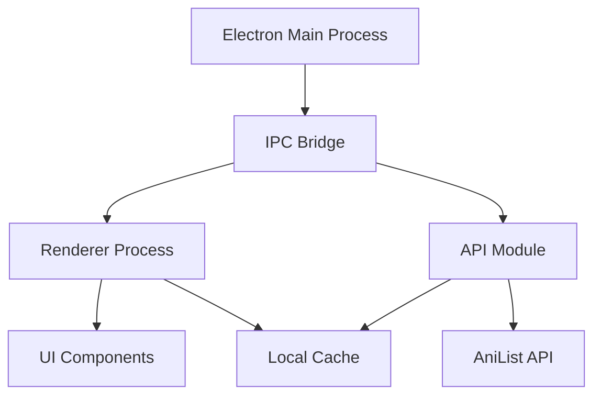
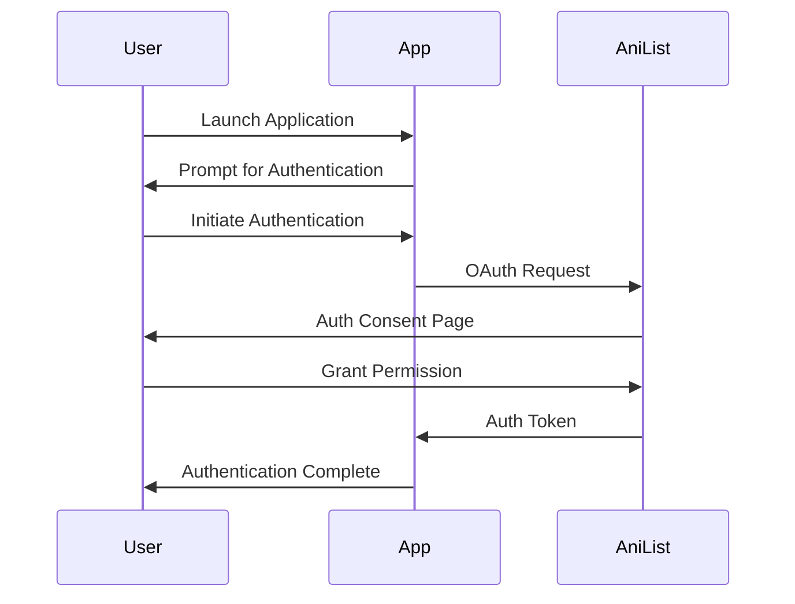
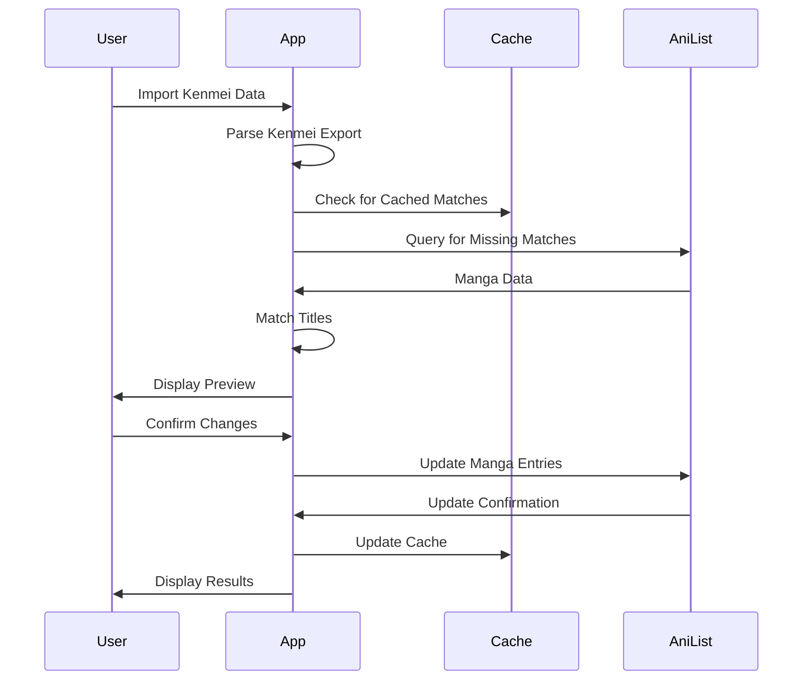

# Architecture for Kenmei to AniList Sync

Status: Approved

## Technical Summary

The Kenmei to AniList Sync application is an Electron-based desktop application built with TypeScript and React. It facilitates the transfer of manga tracking data from Kenmei to AniList. The application will use a modern architecture pattern with clear separation between the Electron main process, renderer process, and API interactions. It leverages the AniList GraphQL API for data synchronization and implements local caching to optimize performance and reduce API calls.

## Technology Table

| Technology        | Description                                                  |
| ----------------- | ------------------------------------------------------------ |
| Electron          | Cross-platform desktop application framework                 |
| TypeScript        | Strongly-typed JavaScript for improved developer experience  |
| React             | Component-based UI library for building interfaces           |
| TailwindCSS       | Utility-first CSS framework for styling                      |
| GraphQL           | Query language for APIs, used for AniList integration        |
| Electron Store    | Persistence library for storing user settings and cache data |
| Vite              | Fast development server and bundler                          |
| TanStack Router   | Type-safe routing library for React                          |
| TanStack Query    | Data fetching and caching library                            |
| Radix UI          | Unstyled, accessible component library                       |
| Sonner            | Toast notification library                                   |
| String Similarity | Library for fuzzy string matching                            |
| Vitest            | Testing framework                                            |
| Playwright        | End-to-end testing framework                                 |
| Framer Motion     | Animation library for React                                  |
| Zod               | TypeScript-first schema validation library                   |
| Webpack           | Module bundler for application packaging                     |
| Fuse.js           | Fuzzy search library for title matching                      |
| Electron Builder  | Packaging and distribution tool                              |

## Architectural Diagrams

### Application Architecture



### Authentication Flow



### Sync Process Flow



## Data Models and API Specs

### Kenmei Export Format (Expected)

```typescript
interface KenmeiExport {
  manga: KenmeiManga[];
}

interface KenmeiManga {
  title: string;
  status: "reading" | "completed" | "on_hold" | "dropped" | "plan_to_read";
  progress: number;
  score?: number;
  last_read_at?: string;
  private?: boolean;
}
```

### AniList Types

```typescript
type MediaListStatus =
  | "CURRENT"
  | "PLANNING"
  | "COMPLETED"
  | "DROPPED"
  | "PAUSED"
  | "REPEATING";

interface AniListManga {
  id: number;
  title: {
    romaji: string;
    english: string;
    native: string;
  };
  format: string;
  status: string;
  chapters?: number;
}

interface AniListMediaEntry {
  mediaId: number;
  status: MediaListStatus;
  progress: number;
  private?: boolean;
  score?: number;
}
```

### Cache Structure

```typescript
interface TitleCache {
  [key: string]: {
    id: number;
    matchConfidence: number;
    lastUpdated: string;
  };
}

interface FormatCache {
  [id: number]: {
    format: string;
    lastUpdated: string;
  };
}

interface AlternativeTitlesCache {
  [id: number]: {
    alternativeTitles: string[];
    lastUpdated: string;
  };
}
```

### GraphQL Queries

#### Get Viewer Info

```graphql
query {
  Viewer {
    id
    name
  }
}
```

#### Get User Manga List

```graphql
query ($userId: Int, $chunk: Int, $perChunk: Int) {
  MediaListCollection(
    userId: $userId
    type: MANGA
    chunk: $chunk
    perChunk: $perChunk
  ) {
    lists {
      entries {
        mediaId
        progress
        status
      }
    }
  }
}
```

#### Search for Manga

```graphql
query ($search: String) {
  Page(perPage: 10) {
    media(type: MANGA, search: $search) {
      id
      title {
        romaji
        english
        native
      }
      format
      chapters
    }
  }
}
```

#### Update Manga Entry

```graphql
mutation (
  $mediaId: Int
  $status: MediaListStatus
  $progress: Int
  $private: Boolean
) {
  SaveMediaListEntry(
    mediaId: $mediaId
    status: $status
    progress: $progress
    private: $private
  ) {
    id
    status
    progress
  }
}
```

## Project Structure

```
├── package.json            # Project configuration
├── tsconfig.json           # TypeScript configuration
├── vite.*.config.ts        # Vite configuration files
├── src/
│   ├── main.ts             # Electron main process entry
│   ├── preload.ts          # Preload script
│   ├── renderer.ts         # Renderer entry point
│   ├── App.tsx             # Main React component
│   ├── types.d.ts          # Global type definitions
│   ├── api/                # API related code
│   │   ├── anilist/        # AniList API integration
│   │   └── kenmei/         # Kenmei data processing
│   ├── components/         # React components
│   │   ├── ui/             # UI components (based on Radix)
│   │   ├── layout/         # Layout components
│   │   ├── import/         # Import-related components
│   │   └── matching/       # Matching-related components
│   ├── contexts/           # React context providers
│   ├── helpers/            # Helper functions
│   │   └── ipc/            # IPC related helpers
│   ├── hooks/              # Custom React hooks
│   ├── layouts/            # Page layouts
│   ├── pages/              # Application pages
│   ├── routes/             # Router configuration
│   ├── services/           # Service layer
│   ├── styles/             # Global styles
│   ├── tests/              # Test files
│   ├── types/              # TypeScript type definitions
│   └── utils/              # Utility functions
├── public/                 # Static assets
└── resources/              # Application resources
    └── icons/              # Application icons
```

## Infrastructure

The application is a desktop application and does not require server-side infrastructure. It runs locally on the user's machine and communicates directly with the AniList API.

### Storage

- User preferences and authentication tokens are stored securely using Electron Store
- Cache data is stored in JSON files in the application's data directory

## Deployment Plan

The application will be packaged and distributed as an installable application for Windows, macOS, and Linux using Electron Builder.

### Distribution Channels

- GitHub Releases
- Application website (future consideration)

### Update Mechanism

- Auto-updates will be implemented using Electron's auto-updater module
- Updates will be distributed through GitHub Releases

## Change Log

| Change        | Description                                                                      |
| ------------- | -------------------------------------------------------------------------------- |
| Initial draft | Initial architecture document                                                    |
| 2024-04-04    | Updated technology stack and project structure to reflect current implementation |
