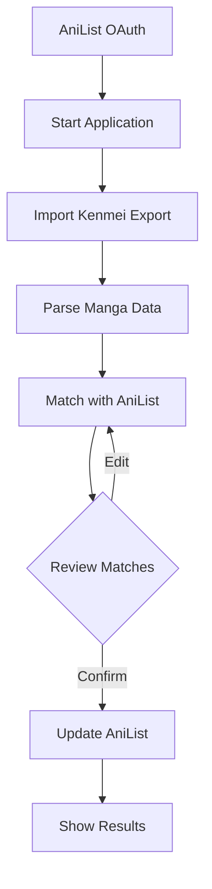

# 1. Title: PRD for Kenmei to AniList Sync

<version>1.0.0</version>

## Status: Approved

## Intro

This project aims to develop an Electron application that allows users to import manga tracking data from Kenmei (a manga tracking service) and synchronize it with their AniList account. The application will parse Kenmei export files, match the manga titles with AniList entries, and update the user's AniList manga list accordingly, including reading progress and status.

## Goals

- Provide a simple, user-friendly interface for importing Kenmei export files
- Accurately match Kenmei manga entries with AniList database entries
- Update AniList manga list with correct reading progress and status
- Allow users to review and confirm changes before submission
- Ensure secure authentication with AniList via OAuth
- Minimize manual intervention required from users
- Support caching to reduce API calls and improve performance

## Features and Requirements

### Functional Requirements

- User authentication with AniList via OAuth
- Import and parse Kenmei export files (JSON format)
- Match Kenmei manga titles with AniList database entries using fuzzy matching
- Handle alternative titles for better matching accuracy
- Update AniList manga list entries (status, progress, score, privacy settings)
- Provide conflict resolution for manga that cannot be automatically matched
- Cache manga data to reduce API calls and improve subsequent imports
- Save user preferences locally for future sessions
- Track and report successful updates and errors

### Non-functional Requirements

- Cross-platform compatibility (Windows, macOS, Linux)
- Responsive and intuitive UI
- Error handling and useful error messages
- Respect AniList API rate limits
- Privacy-focused (no data collection beyond what's needed for functionality)
- Fast performance, especially for large manga collections

### User Experience Requirements

- Clear workflow from import to review to submission
- Visual feedback for actions in progress
- Detailed logs for troubleshooting
- Dark/light mode support
- Ability to customize status mapping between Kenmei and AniList

### Integration Requirements

- AniList GraphQL API integration
- Electron packaging for distribution

## Epic List

### Epic-1: Core Application Structure and UI

Development of the Electron application foundation and user interface.

### Epic-2: Authentication and API Integration

Integration with AniList OAuth and API implementation.

### Epic-3: Data Processing and Synchronization

Processing Kenmei exports and syncing data with AniList.

### Epic-N: Future Enhancements

Potential future improvements like additional tracking services, backup functionality, etc.

## Epic 1: Story List

- Story 1: Project Setup
  Status: Completed
  Requirements:

  - Set up Electron with TypeScript
  - Configure project structure
  - Set up build and packaging pipeline

- Story 2: Basic UI Implementation
  Status: Completed
  Requirements:

  - Create main application window
  - Implement file import functionality
  - Design settings page for AniList authentication

## Epic 2: Story List

- Story 3: AniList API Authentication Implementation
  Status: Completed
  Requirements:

  - Configure AniList OAuth Application settings
  - Implement Electron OAuth workflow
  - Enhance Settings Page UI
  - Implement Token Management
  - Create Auth Context Provider

## Epic 4: Story List

- Story 4: Data Processing and Synchronization
  Status: Planned
  Requirements:

  - Implement Kenmei manga data processing pipeline
  - Add matching algorithm for AniList entries
  - Develop conflict resolution interface
  - Create batch update mechanism
  - Implement progress tracking and error handling

## Technology Stack

| Technology     | Description                                                      |
| -------------- | ---------------------------------------------------------------- |
| Electron       | Framework for creating native applications with web technologies |
| TypeScript     | Primary programming language                                     |
| React          | Frontend library for UI components                               |
| TailwindCSS    | Utility-first CSS framework for styling                          |
| GraphQL        | For interacting with AniList API                                 |
| Electron Store | For persisting user settings locally                             |
| Webpack        | For bundling the application                                     |
| Fuse.js        | For fuzzy matching manga titles                                  |

## Reference

### Application Flow



### AniList GraphQL Queries

The application will use the following GraphQL queries:

#### Get Viewer Info

```graphql
query {
  Viewer {
    id
    name
  }
}
```

#### Get User Manga List

```graphql
query ($userId: Int, $chunk: Int, $perChunk: Int) {
  MediaListCollection(
    userId: $userId
    type: MANGA
    chunk: $chunk
    perChunk: $perChunk
  ) {
    lists {
      entries {
        mediaId
        progress
        status
      }
    }
  }
}
```

#### Update Manga Entry

```graphql
mutation (
  $mediaId: Int
  $status: MediaListStatus
  $progress: Int
  $private: Boolean
) {
  SaveMediaListEntry(
    mediaId: $mediaId
    status: $status
    progress: $progress
    private: $private
  ) {
    id
    status
    progress
  }
}
```

### Status Mapping

| Kenmei Status | AniList Status |
| ------------- | -------------- |
| reading       | CURRENT        |
| completed     | COMPLETED      |
| on_hold       | PAUSED         |
| dropped       | DROPPED        |
| plan_to_read  | PLANNING       |

### Caching Strategy

The application will implement caching for:

- Manga title to AniList ID mappings
- Manga format information
- Alternative titles for improved matching

## Project Structure

```
src/
├── main/                 # Electron main process
│   ├── index.ts          # Main entry point
│   ├── preload.ts        # Preload script
│   └── ipc/              # IPC handlers
├── renderer/             # Electron renderer process
│   ├── components/       # React components
│   ├── pages/            # Application pages
│   ├── styles/           # CSS/TailwindCSS styles
│   └── utils/            # Utility functions
├── shared/               # Shared code between main and renderer
│   ├── types/            # TypeScript types
│   └── constants.ts      # Shared constants
└── api/
    ├── anilist/          # AniList API integration
    │   ├── client.ts     # API client
    │   ├── queries.ts    # GraphQL queries
    │   ├── mutations.ts  # GraphQL mutations
    │   └── types.ts      # AniList specific types
    └── kenmei/           # Kenmei data processing
        ├── parser.ts     # Export file parser
        ├── matcher.ts    # Title matching logic
        └── types.ts      # Kenmei specific types
```

## Change Log

| Change        | Story ID | Description                                       |
| ------------- | -------- | ------------------------------------------------- |
| Initial draft | N/A      | Initial draft PRD                                 |
| Update        | Story-3  | Marked Stories 1-3 as completed and added Story 4 |
