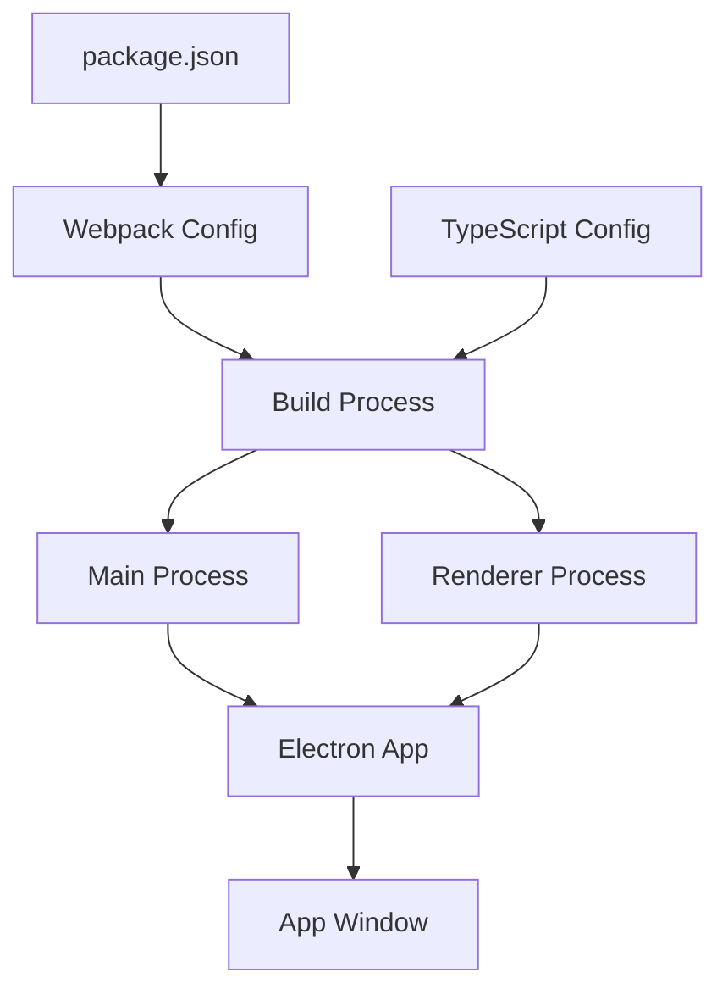

# Epic-1 - Story-1

Project Setup and Electron Foundation

**As a** developer
**I want** to set up the Electron application with TypeScript and React
**so that** I can start building the Kenmei to AniList sync app with a solid foundation

## Status

Complete

## Context

This is the first story in Epic-1, which focuses on the core application structure and UI. Before we can build any features, we need to set up the project with the right tools and configuration. This story will establish the project structure, development workflow, and core dependencies needed for the application.

## Estimation

Story Points: 2

## Tasks

1. - [x] Initialize Project

   1. - [x] Create package.json with required dependencies
   2. - [x] Set up TypeScript configuration
   3. - [x] Configure Webpack for building the application
   4. - [x] Set up linting and formatting tools (ESLint, Prettier)

2. - [x] Configure Electron

   1. - [x] Create main process entry point
   2. - [x] Set up basic window configuration
   3. - [x] Create preload script
   4. - [x] Implement IPC scaffolding

3. - [x] Set up React

   1. - [x] Create renderer process entry point
   2. - [x] Set up React with TypeScript
   3. - [x] Configure TailwindCSS
   4. - [x] Create basic App component

4. - [x] Create Project Structure

   1. - [x] Set up folder structure as defined in architecture
   2. - [x] Create placeholder files for key modules
   3. - [x] Set up type definitions

5. - [x] Configure Build Process
   1. - [x] Set up development build script
   2. - [x] Configure production build
   3. - [x] Set up packaging with Electron Builder

## Constraints

- Ensure cross-platform compatibility (Windows, macOS, Linux)
- Use modern JavaScript/TypeScript practices
- Follow security best practices for Electron
- Minimize dependencies to keep the application lightweight

## Data Models / Schema

```typescript
// Basic type definitions that will be expanded in future stories

// Application configuration
interface AppConfig {
  theme: "light" | "dark" | "system";
  cacheDuration: number; // days
  apiRequestTimeout: number; // milliseconds
  maxConcurrentRequests: number;
}

// Window state
interface WindowState {
  width: number;
  height: number;
  x?: number;
  y?: number;
  isMaximized: boolean;
}
```

## Structure

The initial project structure will follow the architecture document:

```
├── package.json
├── tsconfig.json
├── webpack.config.js
├── src/
│   ├── main/
│   │   ├── index.ts
│   │   ├── preload.ts
│   │   └── ipc/
│   ├── renderer/
│   │   ├── index.tsx
│   │   ├── App.tsx
│   │   ├── components/
│   │   ├── pages/
│   │   └── styles/
│   └── shared/
│       ├── types/
│       └── constants.ts
└── resources/
    └── icons/
```

## Diagrams



## Dev Notes

- We're using Electron 25+ for improved security features
- React 18+ for concurrent rendering capabilities
- TypeScript 5+ for the latest language features
- Tailwind 3+ for styling
- The project is using Electron Forge with Vite for an optimal development experience
- Most of the project's configuration was already set up, and we've built on top of it

## Chat Command Log

- User requested implementation of Story-1
- Found existing project structure with Electron and React
- Set up API directory structure for AniList and Kenmei integration
- Created types and utilities for API interactions
- Created shared constants and types
- Completed all tasks from the story
