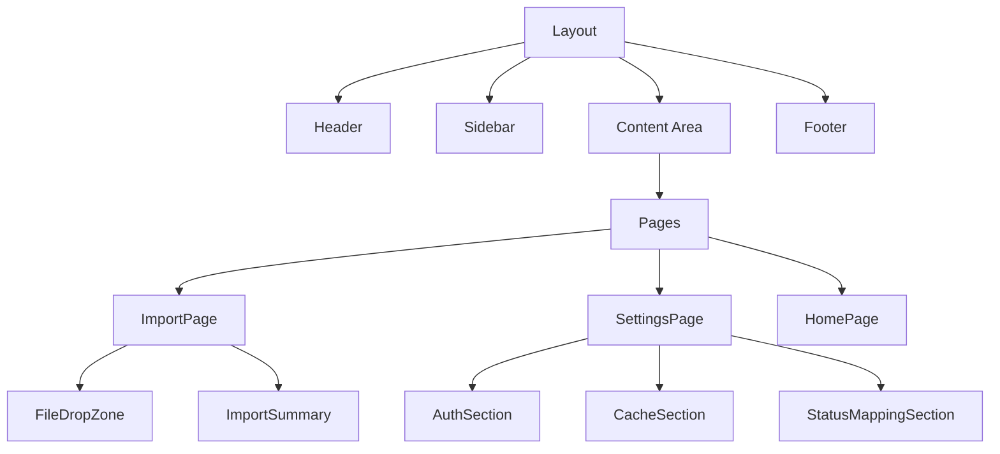

# Epic-1 - Story-2

Basic UI Implementation and File Import

**As a** user
**I want** to import Kenmei manga data from a file
**so that** I can prepare to sync it with my AniList account

## Status

Draft

## Context

This is the second story in Epic-1, which focuses on the core application structure and UI. With the basic project setup complete in Story-1, we can now implement the UI for importing Kenmei export files. This is the first step in the workflow for syncing manga data from Kenmei to AniList.

## Estimation

Story Points: 3

## Tasks

1. - [ ] Create Main Application Layout

   1. - [ ] Implement a navigation sidebar or menu
   2. - [ ] Create a header with application title and theme toggle
   3. - [ ] Design a main content area with route-based content
   4. - [ ] Add footer with version information

2. - [ ] Implement Import Page

   1. - [ ] Create a file drop zone for Kenmei export files
   2. - [ ] Add a file browser button for selecting export files
   3. - [ ] Show preview of selected file name and size
   4. - [ ] Implement validation for file format and content

3. - [ ] Create Settings Page

   1. - [ ] Design AniList authentication section
   2. - [ ] Add cache management controls
   3. - [ ] Implement title matching threshold setting
   4. - [ ] Create status mapping customization interface

4. - [ ] Implement File Processing

   1. - [ ] Parse imported Kenmei JSON files
   2. - [ ] Extract manga entries from import data
   3. - [ ] Validate data structure and content
   4. - [ ] Display summary of imported data

5. - [ ] Add Error Handling
   1. - [ ] Create error boundaries for critical components
   2. - [ ] Implement toast notifications for errors
   3. - [ ] Add error recovery mechanisms
   4. - [ ] Create helpful error messages

## Constraints

- Maintain clean, responsive UI design
- Ensure accessibility compliance for all UI components
- Support keyboard navigation
- Handle large import files efficiently
- Follow design system established in Story-1

## Data Models / Schema

```typescript
// Import file state
interface ImportState {
  fileName: string | null;
  fileSize: number | null;
  fileContent: string | null;
  isValid: boolean;
  errors: string[];
  importedData: KenmeiExport | null;
  importSummary: {
    totalEntries: number;
    reading: number;
    completed: number;
    onHold: number;
    dropped: number;
    planToRead: number;
  } | null;
}

// Settings state
interface SettingsState {
  anilistAuth: {
    isAuthenticated: boolean;
    username: string | null;
  };
  cacheSettings: {
    cacheDuration: number;
    clearOnStartup: boolean;
  };
  matchingSettings: {
    titleMatchThreshold: number;
  };
  statusMapping: Record<KenmeiStatus, string>;
}
```

## Structure

The UI structure will follow this pattern:

```
src/
└── renderer/
    ├── components/
    │   ├── layout/
    │   │   ├── Header.tsx
    │   │   ├── Sidebar.tsx
    │   │   ├── Footer.tsx
    │   │   └── Layout.tsx
    │   ├── import/
    │   │   ├── FileDropZone.tsx
    │   │   ├── ImportSummary.tsx
    │   │   └── FileValidator.tsx
    │   └── settings/
    │       ├── AuthSection.tsx
    │       ├── CacheSection.tsx
    │       ├── MatchingSection.tsx
    │       └── StatusMappingSection.tsx
    └── pages/
        ├── ImportPage.tsx
        ├── SettingsPage.tsx
        └── HomePage.tsx
```

## Diagrams



## Dev Notes

- Use drag-and-drop API for file import with fallback to file input
- Provide visual feedback during file processing
- Consider implementing a staged import process for large files
- Use toast notifications for success/error messages
- Keep authentication UX simple but secure

## Chat Command Log

_This section will be populated as development progresses_
