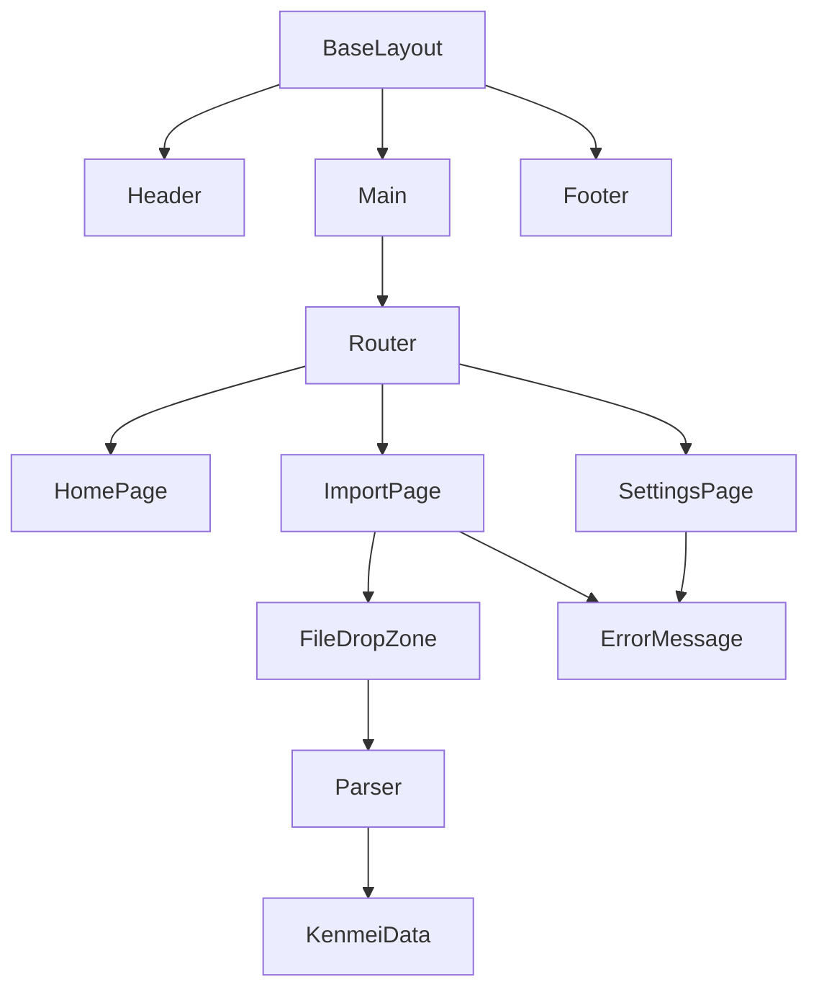

# Story-2: Basic UI Implementation and File Import

**User Story**: As a user, I want to import my Kenmei manga data from a file so I can sync it with my AniList account.

**Status**: Complete

## Context

This is the second story in Epic-1, focusing on the core application structure and user interface. The previous story (Story-1) established the basic project setup and structure. This story focuses on implementing the UI components and file import functionality.

## Estimation

Story Points: 3

## Tasks

- [x] Create main application layout
  - [x] Layout component with header, main content, and footer
  - [x] Navigation sidebar/header with links to main sections
  - [x] Responsive main content area
  - [x] Footer with version information
  - [x] Window controls (minimize, maximize, close)
  - [x] Draggable window regions
- [x] Implement import page
  - [x] File drop zone with drag and drop support
  - [x] File browser button
  - [x] File preview after upload
  - [x] Basic file validation
  - [x] Import summary with status counts
  - [x] Success state with import statistics
- [x] Implement settings page
  - [x] AniList authentication section
  - [x] Cache management options
  - [x] Application information section
  - [x] Auto-sync toggle
  - [x] User profile display with avatar and expiration info
- [x] Implement file processing
  - [x] Parse Kenmei CSV file
  - [x] Validate file format
  - [x] Display import summary
  - [x] Handle errors gracefully
- [x] Design dashboard homepage
  - [x] Collection statistics section
  - [x] Recent activity display
  - [x] Quick actions panel
  - [x] Last sync information
  - [x] Getting started steps
- [x] Implement error handling
  - [x] Invalid file format errors
  - [x] Network error handling
  - [x] User feedback for errors

## Constraints

1. The UI design should be clean, responsive, and accessible
2. Must support keyboard navigation and screen readers for accessibility
3. Should handle large import files efficiently
4. Error messages should be user-friendly and informative

## Data Models / Schema

### Import File State

```typescript
interface ImportFileState {
  fileName: string;
  fileSize: number;
  content: KenmeiData | null;
  isValid: boolean;
  error: string | null;
}
```

### Kenmei Export Structure

```typescript
export interface KenmeiMangaItem {
  title: string;
  status: string;
  score?: number;
  chapters_read?: number;
  created_at: string;
  updated_at: string;
}

export interface KenmeiData {
  version: string;
  exported_at: string;
  manga: KenmeiMangaItem[];
}
```

### Settings State

```typescript
interface AuthState {
  isAuthenticated: boolean;
  username?: string;
  avatarUrl?: string;
  expiresAt?: number;
}
```

## UI Structure

```
src/
  components/
    layout/
      BaseLayout.tsx
      Header.tsx
      Footer.tsx
    import/
      FileDropZone.tsx
    ui/
      button.tsx
      error-message.tsx
  pages/
    HomePage.tsx
    ImportPage.tsx
    SettingsPage.tsx
  api/
    kenmei/
      parser.ts
      types.ts
  utils/
    errorHandling.ts
  types/
    kenmei.ts
```

## Diagrams



## Implementation Details

### Layout and Navigation

- Implemented a responsive layout with header, main content area, and footer
- Created a BaseLayout component to wrap all pages for consistent styling
- Added navigation menu with Home, Import, and Settings links
- Applied consistent styling with gradient text headers

### File Import Process

- Updated file import to process CSV files instead of JSON
- Implemented CSV parser with proper handling of quotes and delimiters
- Added validation for required fields with helpful error messages
- Created a multi-step import process: file selection → summary → success state
- Enhanced status display with color-coded badges and statistics cards

### Dashboard

- Redesigned the dashboard with visually appealing cards and statistics
- Added hover effects and transitions for enhanced user experience
- Implemented quick action cards for common tasks
- Added "Getting Started" section with step-by-step instructions
- Enhanced visual hierarchy with icons, colors, and typography

### Settings Page

- Implemented visually enhanced authentication section with user profile display
- Added avatar image and session expiration information
- Created gradient backgrounds and improved card layouts
- Enhanced buttons with consistent styling and hover effects
- Added application information section with version details

### Error Handling

- Created a robust error handling system with typed errors
- Implemented network request handling with timeouts and error categorization
- Added user-friendly error messages with appropriate visual feedback
- Created reusable error components for consistent error display

## Visual Enhancements

- Added gradient text effects for headings
- Implemented card hover effects with subtle animations
- Created visually distinct status indicators with appropriate colors
- Enhanced buttons with gradients and hover states
- Improved layout spacing and typography for better readability
- Added contextual icons throughout the interface
- Created a consistent visual language across all pages

## Dev Notes

- Used the browser's drag-and-drop API for file imports
- Provided visual feedback during file upload and processing
- Implemented a simple and secure authentication UX for AniList
- Used mock data for dashboard statistics and recent activities
- Created a standard approach to error handling for network requests and user feedback
- Ensured proper TypeScript typing throughout the application
- Optimized component structure by removing redundant Layout wrappers

## Chat Command Log

- Updated CSV file parsing to handle specific Kenmei export format
- Transformed HomePage into a dashboard with statistics and activities
- Fixed various TypeScript linting issues in all components
- Enhanced error handling for file imports
- Implemented comprehensive error handling utilities and components
- Created reusable error message component with different visual styles for error types
- Updated UI with improved visual design across all pages
- Added success state to ImportPage with statistics
- Enhanced SettingsPage with better authentication display
- Improved overall user experience with consistent styling and animations
- Removed redundant Layout wrappers from all pages
- Fixed component structure for better maintainability
