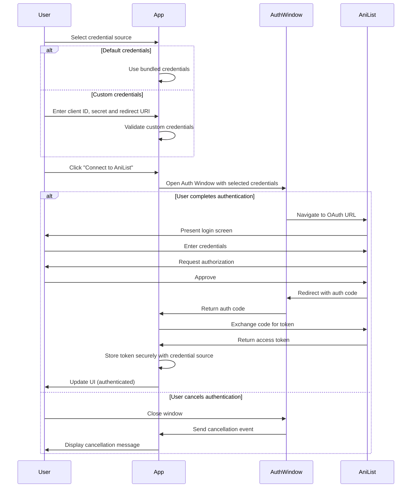

# Story-3: AniList API Authentication Implementation

**User Story**: As a user, I want to securely authenticate with my AniList account so I can sync my manga collection.

**Status**: Complete

## Context

This is the third story in the project, focusing on implementing the AniList API authentication. The previous stories established the project setup (Story-1) and built the basic UI components and file import functionality (Story-2). This story will implement proper OAuth authentication with the AniList API, replacing the current mock implementation in the SettingsPage with real authentication flow.

Currently, the SettingsPage has a simulated authentication flow that doesn't actually connect to AniList. The AniList client module already has functions for OAuth URL generation and token exchange, but they're not integrated with the UI. This story will bridge that gap and implement the complete authentication flow.

A key requirement is to allow users the flexibility to either use the default AniList API credentials provided with the application or input their own client ID and secret if they have registered their own AniList API application.

## Estimation

Story Points: 2

## Tasks

- [x] Configure AniList OAuth Application settings

  - [x] Register application on AniList
  - [x] Store client ID and secrets securely
  - [x] Define proper callback URL handling
  - [x] Create environment configuration
  - [x] Add support for default or custom API credentials

- [x] Implement Electron OAuth workflow

  - [x] Create a secure auth window
  - [x] Handle OAuth redirect and extract code
  - [x] Implement token exchange
  - [x] Add secure token storage
  - [x] Support different redirect URLs based on credentials source
  - [x] Handle window closing as authentication cancellation

- [x] Enhance Settings Page UI

  - [x] Connect UI to real authentication flow
  - [x] Show accurate authentication state
  - [x] Display user profile after authentication
  - [x] Add token refresh functionality
  - [x] Implement proper error handling
  - [x] Add UI for choosing between default or custom API credentials
  - [x] Implement form for custom client ID and secret
  - [x] Add custom redirect URI field for user-provided API applications

- [x] Implement Token Management

  - [x] Add token expiration tracking
  - [x] Implement automatic token refresh
  - [x] Add secure token storage in Electron
  - [x] Create token validation methods
  - [x] Associate tokens with credential source

- [x] Create Auth Context Provider

  - [x] Set up React context for auth state
  - [x] Create hooks for accessing authentication state
  - [x] Implement API client with authentication integration
  - [x] Add authorization headers to API requests
  - [x] Include credential source in context
  - [x] Handle authentication cancellation events

- [x] Fix Application Bugs
  - [x] Resolve API binding conflicts in preload scripts
  - [x] Fix environment variable access in renderer context
  - [x] Update API references in AuthContext to use new naming pattern
  - [x] Ensure proper IPC communication between main and renderer processes
  - [x] Fix issues with unknown error types

## Constraints

1. Must follow OAuth 2.0 best practices
2. Tokens must be stored securely
3. Must handle timeouts and network errors gracefully
4. Must respect AniList API rate limits
5. Must provide clear error messages to the user
6. Must allow switching between default and custom credentials
7. Must validate custom API credentials before use
8. Authentication window closing should be treated as cancellation

## Data Models / Schema

### Authentication State

```typescript
interface AuthState {
  isAuthenticated: boolean;
  username?: string;
  avatarUrl?: string;
  userId?: number;
  accessToken?: string;
  expiresAt?: number;
  credentialSource: "default" | "custom";
}
```

### OAuth Configuration

```typescript
interface OAuthConfig {
  clientId: string;
  clientSecret: string;
  redirectUri: string;
  authorizationEndpoint: string;
  tokenEndpoint: string;
  scope: string;
  isCustomCredentials: boolean;
}
```

### Token Storage

```typescript
interface TokenStorage {
  accessToken: string;
  expiresAt: number;
  refreshToken?: string;
  userId: number;
  credentialSource: "default" | "custom";
  credentialId?: string; // To identify which credentials were used
}
```

### API Credentials

```typescript
interface APICredentials {
  source: "default" | "custom";
  clientId: string;
  clientSecret: string;
  redirectUri: string;
}
```

## Auth Flow Diagram



## Implementation Details

### Credentials Management

The application will support two sources of API credentials:

1. **Default credentials**: Bundled with the application, pre-configured for the official app registration
2. **Custom credentials**: User-provided credentials for those who registered their own AniList API application

The Settings page will provide an option to switch between these sources, with appropriate UI for entering and validating custom credentials. For custom credentials, users can specify their own redirect URI to match their AniList application settings.

### Electron Auth Window

The authentication will be handled in a separate window to ensure security. The main process will create a secure BrowserWindow with appropriate options for OAuth flow:

- No Node integration in renderer
- Contextual isolation enabled
- Secure HTTPS-only traffic
- Proper window size and behavior
- Dynamic redirect URL based on credential source
- Handling window closing as authentication cancellation

### Token Management

Tokens will be stored securely using electron-store with encryption. Token management will include:

- Saving tokens securely
- Monitoring token expiration
- Refreshing tokens when needed
- Clearing tokens on logout
- Tracking which credential source was used for the token

### Auth Context Provider

A React context provider will be created to manage authentication state and provide hooks for components to access authentication information. This will enable:

- Checking authentication status
- Accessing user information
- Making authenticated API requests
- Handling authentication errors
- Determining which credential source is active
- Managing authentication cancellation events

### IPC Communication

IPC communication follows a clean hierarchical structure:

- Each feature has its own context file exposing IPC functions
- Each context file uses a unique API name to avoid conflicts (electronAuth, electronWindow, electronTheme)
- The main context-exposer coordinates all context exposures
- The preload script provides a single entry point for context exposure

## Dev Notes

- The AniList API uses OAuth 2.0 for authentication
- AniList access tokens expire after 1 year, so refresh token functionality is optional
- Rate limiting must be considered for token validation requests
- Error handling is critical for network and authentication failures
- Custom credentials must be validated before use to prevent authentication errors
- Default credentials should be stored securely and not exposed in client-side code
- Environment variables must be handled properly for both main and renderer processes
- IPC API naming should prevent binding conflicts between different feature modules
- Window closing is treated as authentication cancellation for better UX
- Custom redirect URIs allow users to use their own application settings registered on AniList

## Chat Command Log

- Created auth-listeners.ts for handling authentication IPC events between main and renderer processes
- Implemented AuthContext provider for managing authentication state throughout the app
- Updated SettingsPage to use the new AuthContext and support custom API credentials
- Created configuration file for AniList API default credentials
- Updated preload.ts to use proper context exposer module pattern
- Created auth-context.ts for exposing auth-related IPC functions
- Refactored window-context.ts and theme-context.ts to follow consistent pattern
- Updated context-exposer.ts to use all context exposure functions consistently
- Improved code structure with a more modular approach for IPC communication
- Fixed API binding conflicts by using separate API names for each context (electronAuth, electronWindow, electronTheme)
- Fixed environment variable access in renderer context
- Updated AuthContext to use new API names consistently
- Resolved white screen issue caused by IPC conflicts
- Added handling for window closing as authentication cancellation
- Added custom redirect URI support for user-provided API credentials
- Fixed TypeScript errors with proper error type handling
- Enhanced the UI with a redirect URI input field
- Updated authentication flow to handle all possible user interactions
