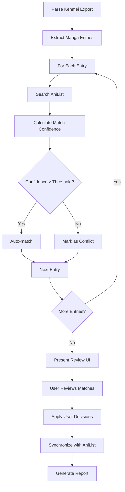

# Story-4: Data Processing and Synchronization

**User Story**: As a user, I want to import my manga data from Kenmei and have it accurately matched and synchronized with my AniList account.

## Status

Draft

## Context

This is the fourth story in the project, focusing on implementing the core functionality of processing Kenmei manga data and synchronizing it with AniList. The previous stories established the project setup (Story-1), built the basic UI components and file import functionality (Story-2), and implemented AniList API authentication (Story-3).

The foundation for both Kenmei data parsing and AniList API integration has been laid out in the respective API modules. The Kenmei parser can extract manga entries from the exported JSON file, and basic structures for manga matching are in place. The AniList client is fully functional with authentication support.

Now we need to create the complete data processing pipeline that will:

1. Parse the Kenmei export data
2. Match each manga title with the corresponding AniList entry
3. Present a confirmation UI for matches and manual resolution for conflicts
4. Update the user's AniList account with the synchronized data

This story represents the core functionality of the application and will implement the critical data flow from import to synchronization.

## Estimation

Story Points: 3

## Tasks

- [x] Enhance Kenmei Data Processing
  - [x] Implement batch processing for large collections
  - [x] Add validation and error handling for import files
  - [x] Extract reading progress and status information
  - [x] Create mapping functionality between Kenmei and AniList status values
  - [x] Add support for handling multiple formats (chapters, volumes) correctly

- [ ] Implement AniList Search and Matching
  - [ ] Create robust search functionality using AniList GraphQL API
  - [ ] Implement fuzzy matching algorithm for title comparison
  - [ ] Support alternative title matching for better accuracy
  - [ ] Add language preference for title matching
  - [ ] Implement confidence score for matches
  - [ ] Create caching mechanism to reduce API calls for common titles

- [ ] Develop Match Review UI

  - [ ] Create a review interface to display all matches
  - [ ] Highlight low-confidence matches for manual review
  - [ ] Allow users to manually search and select alternative matches
  - [ ] Implement a batch confirmation mechanism
  - [ ] Add filtering options (e.g., show only conflicts)
  - [ ] Create detailed view for each manga entry

- [ ] Build Synchronization System

  - [ ] Implement batch update functionality for AniList
  - [ ] Add progress tracking for updating process
  - [ ] Create retry mechanism for failed updates
  - [ ] Implement rate limiting to respect AniList API constraints
  - [ ] Add detailed logging for sync operations
  - [ ] Create summary report of synchronization results

- [ ] Implement Error Handling and Recovery
  - [ ] Create robust error handling for API failures
  - [ ] Add network error recovery mechanisms
  - [ ] Implement partial update capability (resume interrupted syncs)
  - [ ] Create detailed error reporting UI
  - [ ] Add export option for failed matches for later retry

## Constraints

1. Must respect AniList API rate limits
2. Must handle large manga collections efficiently
3. Must provide a user-friendly interface for conflict resolution
4. Must ensure data accuracy and prevent accidental overwrites
5. Must work offline after initial data fetching when possible
6. Must provide detailed feedback during the synchronization process

## Data Models / Schema

### Manga Match Result

```typescript
interface MangaMatchResult {
  kenmeiEntry: KenmeiMangaEntry;
  anilistMatches: {
    media: AniListMedia;
    confidence: number; // 0-100 score
    isExactMatch: boolean;
  }[];
  selectedMatch?: AniListMedia;
  status: "pending" | "matched" | "conflict" | "manual" | "skipped";
  userDecision?: "accept" | "change" | "skip";
  syncStatus?: "pending" | "success" | "error";
  errorDetails?: string;
}
```

### Synchronization Report

```typescript
interface SyncReport {
  totalEntries: number;
  successfulMatches: number;
  manualMatches: number;
  skippedEntries: number;
  failedUpdates: number;
  updatedStatuses: number;
  updatedProgress: number;
  timestamp: Date;
  errors: {
    mangaTitle: string;
    error: string;
  }[];
}
```

### Settings for Matching

```typescript
interface MatchSettings {
  confidenceThreshold: number; // Minimum confidence to consider automatic match
  preferEnglishTitles: boolean;
  preferRomajiTitles: boolean;
  useAlternativeTitles: boolean;
  caseSensitive: boolean;
  statusMapping: Record<KenmeiStatus, AniListStatus>;
}
```

## Matching Flow Diagram



## Implementation Details

### Kenmei Data Processing

The application will enhance the existing Kenmei parser to extract all relevant information from export files. It will implement a status mapping system to convert Kenmei statuses (reading, completed, etc.) to AniList equivalents (CURRENT, COMPLETED, etc.). Progress tracking will be normalized between different formats.

### Matching Algorithm

The matching system will use a multi-step approach:

1. Direct title comparison (normalized)
2. Fuzzy matching for similar titles
3. Alternative title matching
4. Metadata comparison (chapters, author, etc. if available)

Each match will receive a confidence score, with configurable thresholds for automatic acceptance. Low-confidence matches will be flagged for manual review.

### Match Review UI

The review interface will present all manga entries with their potential matches, organized by confidence level. Users can:

- Accept automatic matches
- Choose from alternative suggestions
- Manually search for the correct match
- Skip entries they don't want to sync
- Filter the view to focus on conflicts

### Synchronization System

The sync process will implement batch updates with progress tracking, respecting API rate limits. It will handle network errors gracefully and provide a detailed log of actions taken. Users can retry failed updates or export them for later attempts.

### Caching Strategy

To improve performance and reduce API calls, the application will implement caching for:

- AniList search results
- User's current manga list
- Previously successful matches

The cache will be persistent between sessions to speed up subsequent synchronizations.

## Dev Notes

- The AniList API has rate limits (90 requests per minute) that must be respected
- Title matching is challenging due to different naming conventions across platforms
- The synchronization process should be designed to be resumable in case of interruption
- User intervention should be minimized through intelligent matching, but always available
- Progress tracking is essential for large collections
- Error handling should be comprehensive and user-friendly

## Chat Command Log

- Created enhanced KenmeiManga interface to include volume information and alternative titles
- Added KenmeiParseOptions interface for more flexible parsing configuration
- Implemented batch processing functionality in parser.ts
- Created status-mapper.ts for handling mapping between Kenmei and AniList statuses
- Created data-processor.ts for handling batch processing and format conversions
- Added support for volume-based progress tracking
- Implemented data validation and error handling for import files
- Added comprehensive status mapping with custom mapping support
- Created utility functions for statistics and filtering
