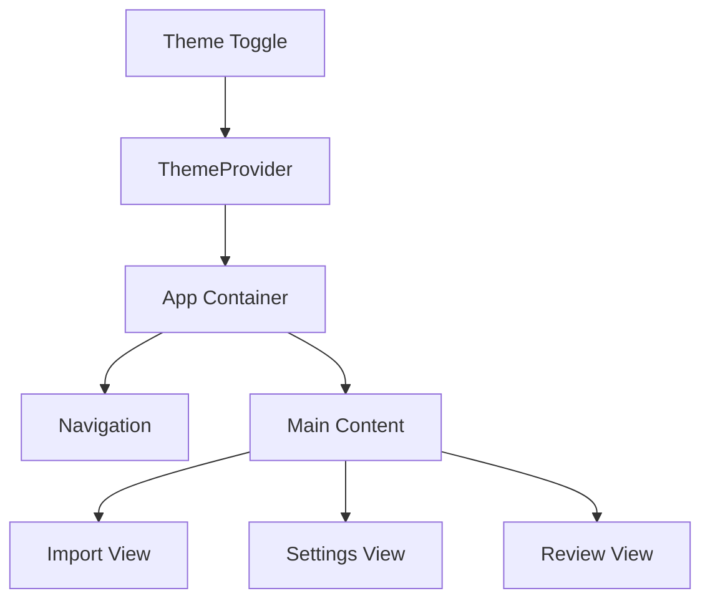

# Epic-3 - Story-5

# UI Enhancement

**As a** user
**I want** a modern, responsive and accessible UI
**so that** I can easily navigate and use the application on different devices and with assistive technologies

## Status

In Progress

## Context

This story is part of Epic-3 which focuses on enhancing the application's user interface. Story-4 (Data Processing and Synchronization) has been completed, providing the core functionality for processing Kenmei data and syncing with AniList. Now we need to improve the UI to make it more user-friendly, accessible, and visually appealing.

## Estimation

Story Points: 3

## Tasks

1. - [ ] Implement Radix UI Components
   1. - [ ] Replace current components with Radix UI equivalents
   2. - [ ] Customize theme to match application design
   3. - [ ] Ensure proper integration with existing functionality
2. - [x] Add Dark/Light Theme Support
   1. - [x] Implement theme switch component
   2. - [x] Create theme context provider
   3. - [x] Define color variables for both themes
   4. - [x] Add persistence for theme preference
3. - [ ] Improve Application Layout and Navigation
   1. - [ ] Redesign main application layout
   2. - [ ] Optimize navigation flow
   3. - [ ] Add visual feedback for actions
4. - [ ] Add Responsive Design Elements
   1. - [ ] Implement responsive layout
   2. - [ ] Optimize for different screen sizes
   3. - [ ] Test on various devices
5. - [ ] Implement Accessibility Features
   1. - [ ] Add proper ARIA labels
   2. - [ ] Ensure keyboard navigation
   3. - [ ] Implement focus management
   4. - [ ] Test with screen readers

## Constraints

- Must maintain compatibility with all existing functionality
- Accessibility must meet WCAG 2.1 AA standards
- Performance should not be significantly impacted by UI enhancements

## Data Models / Schema

No new data models are required for this story.

## Structure

UI enhancements will be implemented in the following directories:

- `src/renderer/components/` - For Radix UI component implementation
- `src/renderer/styles/` - For theme-related styling
- `src/renderer/contexts/` - For theme context provider

## Diagrams

## Dev Notes

- Radix UI provides unstyled, accessible components that we'll need to style with TailwindCSS
- We should use the `prefers-color-scheme` media query for initial theme detection
- Focus on component reusability and consistency across the application
- Consider using CSS variables for theming to make it easier to switch between themes

## Chat Command Log

- User: Mark story 4 as complete and then continue to work on story 5.
