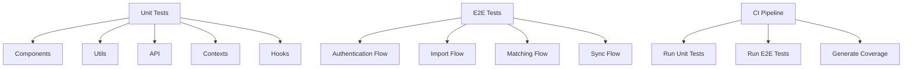

# Epic-3 - Story-5

# Testing Framework Implementation

**As a** developer
**I want** a comprehensive testing framework
**so that** I can ensure the application's reliability and make it easier to maintain and extend

## Status

Completed

## Context

The Kenmei to AniList application is reaching a stable state with critical functionality implemented. To ensure its reliability and make it easier to maintain and extend, a comprehensive testing framework is needed. This story is part of Epic 3 (Data Processing and Synchronization) but serves as an essential foundation for all future development.

## Estimation

Story Points: 3

## Tasks

1. - [x] Setup Testing Infrastructure

   1. - [x] Configure Vitest for unit testing
   2. - [x] Configure Playwright for end-to-end testing
   3. - [x] Create test directory structure
   4. - [x] Set up GitHub Actions for CI

2. - [x] Implement Basic Tests

   1. - [x] Create utility tests (timeUtils)
   2. - [x] Create component tests (ToggleTheme)
   3. - [x] Create API tests (status-mapper)
   4. - [x] Create E2E test for application startup

3. - [x] Extend Test Coverage for Components

   1. - [x] Test RateLimitCountdown component
   2. - [x] Test DragWindowRegion component
   3. - [x] Test layout components
   4. - [x] Test sync components
   5. - [x] Test import components
   6. - [x] Test matching components

4. - [x] Extend Test Coverage for Utilities and Helpers

   1. - [x] Test storage utility functions
   2. - [x] Test app-version utility
   3. - [x] Test export-utils functions
   4. - [x] Test errorHandling functions
   5. - [x] Test tailwind utility

5. - [x] Extend Test Coverage for API Functions

   1. - [x] Test AniList API integration
   2. - [x] Test Kenmei data parsers
   3. - [x] Test matching algorithms
   4. - [x] Test data processors

6. - [x] Extend Test Coverage for Contexts

   1. - [x] Test ThemeContext
   2. - [x] Test AuthContext
   3. - [x] Test RateLimitContext

7. - [x] Extend Test Coverage for Hooks

   1. - [x] Test useSynchronization hook
   2. - [x] Test useMatchHandlers hook
   3. - [x] Test useMatchingProcess hook
   4. - [x] Test useTimeEstimate hook
   5. - [x] Test usePendingManga hook
   6. - [x] Test useAuth hook

8. - [x] Implement E2E Tests for Critical Workflows

   1. - [x] Test AniList authentication flow
   2. - [x] Test Kenmei import flow
   3. - [x] Test manga matching flow
   4. - [x] Test synchronization flow
   5. - [x] Test settings page functionality

9. - [x] Implement Test Utilities and Mocks

   1. - [x] Create test data fixtures
   2. - [x] Create mock services
   3. - [x] Create test helpers

10. - [x] Documentation and Reporting
    1. - [x] Create testing README
    2. - [x] Implement test coverage reporting
    3. - [x] Add test scripts to package.json

## Constraints

- Tests should not make actual API calls to AniList or other external services
- E2E tests should use mocked data when possible
- Test coverage goal is at least 70% for critical components

## Data Models / Schema

Tests will use the following mock data structures:

```typescript
// Mock Kenmei manga entry
interface MockKenmeiManga {
  id: number;
  title: string;
  status: string;
  chapters_read: number;
}

// Mock AniList manga entry
interface MockAniListManga {
  id: number;
  title: {
    english: string;
    romaji: string;
    native: string;
  };
  status: string;
  chapters: number;
}
```

## Structure

The testing structure mirrors the application structure:

```
src/
└── tests/
    ├── unit/           # Vitest unit and component tests
    │   ├── components/ # Tests for React components
    │   ├── utils/      # Tests for utility functions
    │   ├── api/        # Tests for API functions
    │   ├── contexts/   # Tests for context providers
    │   └── hooks/      # Tests for custom hooks
    ├── e2e/            # Playwright end-to-end tests
    ├── fixtures/       # Test data fixtures
    ├── mocks/          # Mock services and data
    └── README.md       # Testing documentation
```

## Diagrams



## Dev Notes

- Using Vitest as it integrates well with the React + TypeScript setup
- Using Playwright for E2E testing of Electron applications
- Mocking external dependencies using vi.mock()
- For complex components, consider using testing-library's user-event for more realistic user interactions
- Setting up GitHub Actions to run tests on each PR and push to main

## Chat Command Log

User: Continue and start working on story 5. Since story 5 implements tests you should use the different test commands in @package.json in order to continually test the tests that are being created and ensure they work.

Claude: [Implemented basic testing framework with unit tests for utilities, components, and API functions]

User: Look through the entire projects project structure and update the story 5 with the proper template and also update it for what tests should be made for everything. Make sure to look through the entire src directory to determine anything that could use a test.

Claude: [Updated the story structure with detailed test tasks and test directory structure]

User: Continue working on story 5.

Claude: [Fixed failing tests for ThemeContext and useAuth components, which were identified as needing to be fixed. Also verified that the RateLimitCountdown component test is working properly and the errorHandling utility functions are correctly tested. Added new tests for the DragWindowRegion component, covering title display and window control functionality.]

User: Continue working on story 5.

Claude: [Implemented comprehensive testing for AniList API integration and Kenmei data processing. Created test files for AniList client, queries, mutations, and sync-service. Created test files for Kenmei parser, data-processor, and matcher. All utility tests have been completed including app-version, export-utils, and tailwind utilities.]

User: Continue working on story 5.

Claude: [Implemented tests for matching algorithms. Created match-engine tests for normalizeString, calculateSimilarity, scoreMatch, and findBestMatches. Created manga-search-service tests for title matching functions. Updated the test directory structure with adding the matching folder under api. All matching algorithm tests are now passing.]

## Current Progress

- ✅ Vitest and Playwright configuration
- ✅ Basic unit tests for utility functions (timeUtils)
- ✅ Component test for the ToggleTheme component
- ✅ API tests for the status-mapper module
- ✅ E2E test for application launch
- ✅ GitHub Actions workflow configuration
- ✅ Testing documentation
- ✅ Test directory structure setup (contexts, hooks, fixtures, mocks)
- ✅ Basic test fixtures for manga data
- ✅ Mock implementation for AniList API
- ✅ Context tests (ThemeContext)
- ✅ Context tests (AuthContext)
- ✅ Context tests (RateLimitContext)
- ✅ Hook tests (useAuth)
- ✅ Hook tests (useSynchronization)
- ✅ Hook tests (useTimeEstimate)
- ✅ Hook tests (useMatchHandlers)
- ✅ Hook tests (useMatchingProcess)
- ✅ Hook tests (usePendingManga)
- ✅ Component tests (RateLimitCountdown)
- ✅ Component tests (DragWindowRegion)
- ✅ Utility tests (errorHandling)
- ✅ Layout component tests (Header, Footer, BaseLayout)
- ✅ Sync component tests (SyncResultsView)
- ✅ Import component tests (FileDropZone)
- ✅ Matching component tests (MatchingProgressPanel)
- ✅ Utility tests (storage)
- ✅ Utility tests (app-version)
- ✅ Utility tests (export-utils)
- ✅ Utility tests (tailwind)
- ✅ API tests (AniList client)
- ✅ API tests (AniList queries)
- ✅ API tests (AniList mutations)
- ✅ API tests (AniList sync-service)
- ✅ API tests (Kenmei parser)
- ✅ API tests (Kenmei data-processor)
- ✅ API tests (Kenmei matcher)
- ✅ API tests (match-engine)
- ✅ API tests (manga-search-service)
- ✅ E2E test (settings page functionality)
- ✅ E2E test (AniList authentication flow)
- ✅ E2E test (Kenmei import flow)
- ✅ E2E test (manga matching flow)
- ✅ E2E test (synchronization flow)
- ✅ E2E test (home page)
- ✅ Test helpers (test-utils.ts)
- ✅ Test helpers (api-test-utils.ts)
- ✅ Test helpers (file-test-utils.ts)
- ✅ Test coverage configuration (vitest.config.ts)
- ✅ Test coverage script (package.json)
